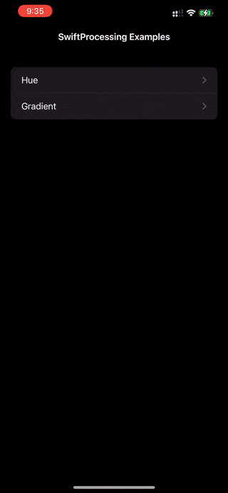

# SwiftUI Cheat Sheet

This document is a cheat sheet I created for myself but perhaps it will be useful to others. I will continue to work on it as I learn more about SwiftUI. If you see mistakes or have suggestions, please feel free to contact me at masood@masoodkamandy.com.

## What is SwiftUI

SwiftUI is a domain-specific programming language embedded within Swift that leverages [Swift's function builders](https://www.vadimbulavin.com/swift-function-builders-swiftui-view-builder/) concept. Unlike UIKit, SwiftUI is [declarative](https://medium.com/@rmeji1/declarative-and-imperative-programming-using-swiftui-and-uikit-c91f1f104252) and handles updating views for you whereas the imperative design of UIKit requires that you define every action based on events that are triggered generally using functions. The design of SwiftUI generally results in complex user interfaces being possible with very little code.

What I hope this guide eventually does is to help demystify something that can seem quite opaque at first. I'm also hoping this can be a repository for my own research in the area so that I don't have to re-learn concepts when I need them.

## Creating a New SwiftUI App

It's always good to know what the default code in an app is. Let's take a look at `ContentView.swift`. SwiftUI is unique in that the default app actually includes a lot of clues as to how SwiftUI works:

```swift
import SwiftUI

struct ContentView: View {
    var body: some View {
        Text("Hello, world!")
            .padding()
    }
}

struct ContentView_Previews: PreviewProvider {
    static var previews: some View {
        ContentView()
    }
}
```

The first struct `ContentView` is where all of your UI design will happen. By default, everything in SwiftUI starts out **centered**. All of the declarative structures in SwiftUI are **capitalized**. 

SwiftUI code is parsed into a tree structure, so there is a lot of **[method chaining](https://en.wikipedia.org/wiki/Method_chaining)** ([another link](https://blog.avenuecode.com/how-well-do-you-know-swiftui)) for modifying views. The structure of a user interface is based on various ContentViews that are placed on the screen and filled with different types of content. These are **not objects, but rather are values,** which has a lot of implications for how we should think about SwiftUI projects. If you look at the view debugging of the basic app, you'll see this structure.


## SwiftUI is Based on a Tree Structure

In the baseline code for a SwiftUI app, there is only one child within the body of the ContentView's body: the text label. That child has a child, which is the modifier that adds the padding on the next line. Thinking about SwiftUI in terms of a tree, as long as you are familiar with that concept, can be very helpful when "thinking in SwiftUI." This idea is, admittedly, not mine and comes from the amazing book [*Thinking in SwiftUI* by objc.io](https://www.objc.io/books/thinking-in-swiftui/).

To display its content, SwiftUI divides the scene into however many children are within each view and adds default padding. A good way to visualize this is to draw some rectangles.

```swift
import SwiftUI

struct ContentView: View {
    var body: some View {
        VStack {
            Rectangle()
                .foregroundColor(.red)
            Rectangle()
                .foregroundColor(.green)
            Rectangle()
                .foregroundColor(.blue)
            Rectangle()
                .foregroundColor(.gray)
        }
    }
}

struct ContentView_Previews: PreviewProvider {
    static var previews: some View {
        ContentView()
    }
}
```


In this example the `body` has **one child** which is **the `VStack`**. The `VStack` then has **4 children** which are the **`Rectangle`s**. These shapes are distributed evenly in a vertical fashion because we are inside a `VStack`.

## VStacks & HStacks

The two primary structures for laying things out in SwiftUI that you should first learn are VStacks and HStacks. These are very simple structures that, by default, simply distribute their contents evenly either vertically or horizontally. This basic foundation of SwiftUI turns out to be extremely powerful 

```swift
import SwiftUI

struct ContentView: View {
    var body: some View {
        VStack {
            Rectangle()
                .foregroundColor(.red)
                .padding()
                .border(.purple, width: 10)
            Rectangle()
                .foregroundColor(.green)
                .padding()
            Rectangle()
                .foregroundColor(.blue)
                .padding()
            Rectangle()
                .foregroundColor(.gray)
                .padding()
        }
        .frame(width: 300, height: 300, alignment: .leading)
    }
}

struct ContentView_Previews: PreviewProvider {
    static var previews: some View {
        ContentView()
    }
}
```

In this code you can see a few different things. One you can see that you can change the size of VStacks. The parent still centers it in the screen. This is done using a method chained onto the VStack itself called `frame()`.

## Order Matters with Method Chaining

In the code above we can make a small change and drastically change the look. For the first rectangle we could do it this way (shown in the **left** image below):

```swift
Rectangle()
  .foregroundColor(.red)
  .padding()
  .border(.purple, width: 10)
```

Or this way (shown in the **right** image below):

```swift
Rectangle()
  .foregroundColor(.red)
  .border(.purple, width: 10)
  .padding()
```

Here are the two different results:


## @State Variables

The way the view structure of SwiftUI works, the view is only updated when it knows that state changes. This is profoundly useful in that it leaves a lot of the work that used to be done by programmers to SwiftUI. When we need to create a variable that might affect the view, we declare it using the keyword `@State` before `var`. This tells SwiftUI to watch this variable for changes. When a change is detected, the tree structure of the view is re-evaluated to account for the change.

The neat thing about @State variables is that SwiftUI knows which children within the view structure actually utilize this variable and it *only* updates those. This has performance benefits.

## SwiftUI Reference

`Color()`

`Text()`

`Image()`

`.resizable()`

`.scaledToFit()`

`VStack {}`

`HStack {}`

`ZStack {}` - Overlapping views. One view on top of another.

`Spacer()`

`.padding()`

`.offset()`

`NavigationView {}`

`List {}`

`.navigationTitle`

`.navigationBarTitleDisplayMode()`

`NavigationLink()`

[Resource](https://sarunw.com/posts/navigation-in-swiftui/)

`UIViewRepresentable`

[Resource](https://stackoverflow.com/questions/58388490/need-help-whenintegrating-complex-uiview-with-swiftui-failed)

`ForEach()`

```swift
import SwiftUI

struct ContentView: View {
    var body: some View {
        HStack {
            ForEach(1...20, id: \.self) { x in
                Rectangle()
                    .foregroundColor(Color(hue: Double.random(in: 0...1.0), saturation: 0.5, brightness: 1.0))
            }
        }
    }
}

struct ContentView_Previews: PreviewProvider {
    static var previews: some View {
        ContentView()
    }
}

```


`if`/`else`

`switch`

## Linking SwiftUI and UIKit Views

Because my focus is bridging SwiftUI and UIKit views (being one of the developers of SwiftProcessing) this is a use case that's very helpful. It may also help people who are trying to build portfolios of smaller projects that use UIKit or who are using libraries/frameworks that still rely upon UIKit.

In all of the resources I've read, I've learned that SwiftUI is not meant to take the place of UIKit. Rather, the framework is actually built on top of UIKit and is meant to solve a family of bugs that are related to state management. Because SwiftUI keeps such good track of what children in its view tree need updating, it's a very efficient way to update a UI. It makes it so that developers don't have to do as much management as they had to in the past. That said, it is built on top of UIKit, so, if you need to, you should be able to interface the two.

My use case is simple: I need a portfolio app that shows things I'm working on.

For this we'll use a `List` in a `NavigationView`, as well as some `NavigationLink`s to get us where we want to go.

Since SwiftProcessing is built as a subclass of `UIView`, we'll use a protocol for SwiftUI called `UIViewRepresentable` to work with it in SwiftUI. Here is my `ContentView.swift` file:

```swift
import SwiftUI

struct ContentView: View {
    var body: some View {
        NavigationView {
            List {
                NavigationLink("Hue", destination: HueView())
                NavigationLink("Gradient", destination: GradientView())

                    .navigationTitle("SwiftProcessing Examples")
                    .navigationBarTitleDisplayMode(.inline)
            }
        }
        
    }
}

struct HueView: UIViewRepresentable {
    func makeUIView(context: Context) -> Hue {
        Hue()
    }
    
    func updateUIView(_ view: Hue, context: Context) {
        view.setNeedsDisplay()
    }
}

struct GradientView: UIViewRepresentable {
    func makeUIView(context: Context) -> Gradient {
        Gradient()
    }
    
    func updateUIView(_ view: Gradient, context: Context) {
        view.setNeedsDisplay()
    }
}


struct ContentView_Previews: PreviewProvider {
    static var previews: some View {
        ContentView()
    }
}

```

Here I am linking to two SwiftProcessing projects. In order to display them, I need to create destinations that conform to the `UIViewRepresntable` protocol. This protocol is a wrapper around a `UIView` that enables it to work with SwiftUI.



The `Hue()` and `Gradient()` classes are just normal SwiftProcessing projects with the classes renamed to be unique. No other modification was done to those files, so this presents an awesome opportunity for organizing projects.